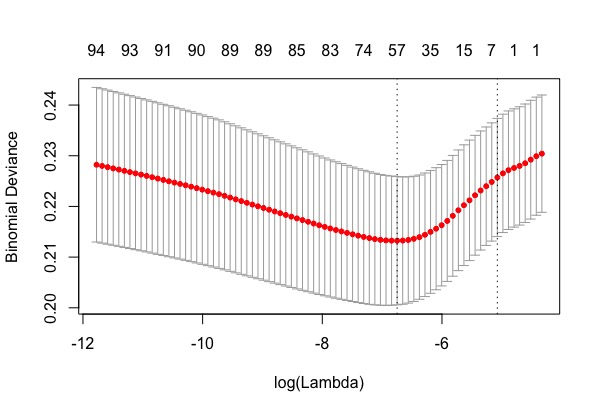
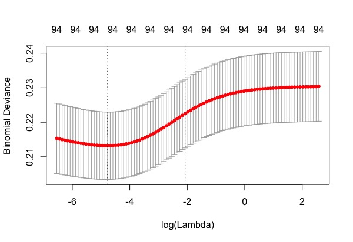

```{r setup, include=FALSE}
knitr::opts_chunk$set(
	echo = TRUE,
	message = FALSE,
	warning = FALSE
)
# Libraries
library(treemap)
library(highcharter)
library(DT)
library(networkD3)
library(heatmaply)
library(tidyverse)
library(flexdashboard)
library(viridisLite)
library(shiny)
library(xml2)
library(grDevices)
library(distances)
library(gridExtra)
library(ggplot2)
library(reshape2)
library(wordcloud2)
library(readxl)
library(knitr)
# Theme to use for highcharts (from example htmlwidgets page)
thm <- 
  hc_theme(
    colors = c("#1a6ecc", "#434348", "#90ed7d"),
    chart = list(
      backgroundColor = "white",
      style = list(fontFamily = "Source Sans Pro")
    ),
    xAxis = list(
      gridLineWidth = 1
    )
  )

red <- "rgba(205, 77, 77, 0.7)"
green <- "rgba(77, 205, 77, 0.7)"
blue <- "rgba(77, 77, 205, 0.7)"
###############################
### Data read in/processing ###
###############################
# Senator nodes
nodes <- read.csv("./data/nodes_proc.csv") %>% 
  mutate(label = paste0(last_name, ", ", first_name, " (", party, "-", state, ")"))
# Cosponsorship edges
simp_edges <- read.csv("./data/simplified_edges.csv")
# For heatmap
subject_matrix <- nodes %>%
  select(bioguideId, label, party, in_113, in_114, in_115) %>%
  left_join(read_csv("./data/member_leg_subject_matrix.csv"))
# Bill data for maps etc
mapdata3 <- read_csv("./data/mapdata3.csv")
mapdata<-mapdata3
# For individual Senator page
senatordata <- mapdata3
senatordata$senator <- paste(senatordata$first_name,senatordata$last_name,sep=" ")
senatordata$image <- paste("https://www.congress.gov/img/member/", tolower(senatordata$bioguideId), ".jpg", sep="")
# List for dropdown on map page
policy_area_list <- mapdata3 %>% 
  arrange(policy_area) %>% 
  .$policy_area %>% 
  unique()
# Processing map data for map page
mapdata3 <- mapdata3 %>%
  group_by(session, state_name, state, policy_area) %>%
  summarise(total_submit = sum(n()))

#For the modeling Data
fittedprob=read_csv("data/fittedprob.csv")
stack<-read_excel("data/stack.xlsx")
```


## 1. Overiew and Motivation

A lot of changes are happening in our government, and while the major focus has been towards the executive branch, it should not be overlooked that congress is in charge of the majority of the laws we live by each day. With the current political climate, we feel the public deserves a more transparent insight into its daily activities. The 115th Legislative Session began in January 2017, and so far, has been a tumultuous journey; from healthcare to the environment, to tax reform to the bills that the media overlooks, major changes have ocurred and will continue to occur that could impact every U.S. resident.   

Our objective is to create resources to allow the public to better understand how congress works, and what they spend their time on. There are an overwhelming number of bills introduced during each legislative session (>6,000), and many Americans do not know what they contain, or who sponsors them. Given the public's distaste for the way media frames political discussions, it is becoming more important for individuals to understand the process and be given raw information to draw their own conclusions. Normally the media is focused on one or two bills, despite many being discussed concurrently. 

Specifically, we want to examine major factors that could contribute or hinder a bill's success, and try to make predictions for bill outcomes. This will include educating the public on the different outcomes a bill can have (there are several!). Additionally, we will evaluate the congressional network, to determine the connectivity degree of the legislators. Do some of them simply sit back as a passive participant? Who has bipartisan connections, and who remains within the boundaries of their own party?  Finally, we want to create clear, concise visuals so the public has an opportunity to explore the focus areas for a certain party, state, or legislator. *The resource will focus less on examining specific bills that actually get passed, and more about where legislators focus their time, and how. (not sure about this last sentence)*


## 2. Related Work

The inspiration for this project came from several directions. It is virtually impossible to ignore the daily discussion of bills that are US news networks decide to focus on. After some discussion, it made us realize we do not really know a whole lot about the bills going through congress, other than the ones discussed on the internet or on TV. While the classic schoolhouse rock [video](https://youtu.be/tyeJ55o3El0) provides an overview of the bill process, and congress.gov allows you to examine bills individually, very few resources exist to allow the public to visualize trends overall. 


## 3. Initial Questions

We had several initial questions that served as the basis for our exploration, and different techniques (discussed below) in order to approach our questions. 


 > What is the prevalence of bill topic, by: legislative session?	by legislator? by state?  
 > What is the probability that a  certain bill topic be voted on, or become a  law? Do significant trends even exist that can predict outcomes?
 > How does geography and region affect policy area and legislative subject focus areas?
 > How many bills do states generally sponsor each session? How does number and topic differ among legislators from the same state?
	prevalence of bill topic in general; likelihood of a certain bill topic to be voted on; likelihood of a certain topic to become a law
 > Which legislators have similar interests? Which legislators work with each other, and cosponsor bills together? This will include a network analysis 


In general, we were not looking to really answer one big question (although both bill outcomes, network connectivity, and policy area focus were all explored), but rather creating tools that could be utilized to explore activities in congress and understand bills better. 

We discussed using the following methods and tools in our data analysis. While several of them evolved throughout the project, these helped serve as the basis of our project and provided direction in our exploration. 

### 3.1 Data Visualization

We decided to utilize several different data visualization tools to analyze and present our data. Depending on the topic, different presentations were considered more appropriate. Initially, our visualizations were determined to include: geographic distributions, summary statistics and tables, heat maps, and word clouds. 

### 3.2 Network Connectivity

We were interested in examining the cosponsorship network in the Senate. There is some debate over [how meaningful cosponsorship is](https://www.salon.com/2013/08/02/congress_favorite_time_wasting_scam_co_sponsoring_bills/), but the fact that so much effort is expended on wrangling cosponsors makes it worthy of examination. For some quick background, every bill introduced to the Senate has one sponsor, who is the member responsible for its submission. After that, any number of Senators can sign on to the bill as cosponsors (at any point in time). The network visualization will allow the public to see the direction of influence, who is working across party lines, and which legislators work with others. 

### 3.3 Bill Outcome Predictions

#### 3.3.1 Binary Logistic Regression

Since the goal of a bill is eventually becomes to law, we can model the outcome as an indicator variable(become to law or not become to law). The binary logistic model can be used to estimate the probability of bills become to law based on continuous and categorical predictor variables. It allows us to say that the presence of a predictor variable increases the odds of a bill becomes to law.


#### 3.3.2 Ordinal Logistic Regression

Since certain bill outcomes are better than others (i.e. a bill that becomes a law is more successful than a bill that gets voted on and fails), ordinal regression is explored. In statistics, ordinal regression (also called "ordinal classification") is a type of regression analysis used for predicting an ordinal variable, i.e. a variable whose value exists on an arbitrary scale where only the relative ordering between different values is significant. However, proportional odds must hold in order for this to be utilized. 

#### 3.3.3 Multinomial Logistics Regression

If ordinal regression assumptions do not hold, multinomial regression could also be explosed. Multinomial regression is used to describe data and to explain the relationship between one dependent nominal variable and one or more continuous-level(interval or ratio scale) independent variables.However, since the number of bills that actually got to the second step is fairly small.

#### 3.3.4 Regularization

There are two major issues with our data-set when modeling the probability of bills get to certain stage. First, some of the categories have very few observation. Second, since many of our predictors are categorial variables (ie. states, topics, interaction terms), we have too many parameters in the model. Regularization is a technique used to avoid this overfitting problem. The idea behind regularization is to penalize the models that overfit the data. Lasso jses L-1 norm and performs both variable selection and regularization in order to enhance the prediction accuracy. Ridge Regularization uses L-2 norm and works well when the data suffers from multicollinearity. 

## 4. Data 

### 4.1 Data Source

We are using congressional records from Congress.gov. They provide downloadable, bulk data with information on bills, timelines and voting records. https://github.com/usgpo/bill-status/blob/master/BILLSTATUS-XML_User_User-Guide.md. We may also utilize voting records (http://clerk.house.gov/legislative/legvotes.aspx) 
We looked into bills that are from 113, 114, and 115 legislative sessions (Jan 2013 - Oct 2017).  

### 4.2 Data Scraping

We scraped 115 session bills from https://www.gpo.gov/fdsys/bulkdata/BILLSTATUS/ using the code below. The data is saved under rawdata folder. In addition, we were able to download the 113 and 114 session bills in bulk from congress.gov, which saved us a few hours. 

```{r eval=FALSE}
# Imports
library(tidyverse)
library(stringr)
library(rvest)
library(xml2)
#####

# Functions
get_bill_list <- function(congress_no, bill_type){
  base_url <- "https://www.gpo.gov/fdsys/bulkdata/BILLSTATUS/"
  # concatenate full url
  page_url <- paste0(base_url, as.character(congress_no), "/", bill_type)
  # Get table with all bills
  tab <- html_node(read_html(page_url), "table.styles3") %>% 
          html_table(header = TRUE, fill = TRUE)
  # There are two header rows 
  # We want the second one
  # Rename columns with first row data
  # then delete first row
  colnames(tab) <- tab[1, ]
  tab <- tab[-1, ]
  # Just in case
  tab <- filter(tab, grepl("xml", Name))
  return(tab)
}

get_bill_data <- function(bill, congress_no, bill_type) {
  base_url <-  "https://www.gpo.gov/fdsys/bulkdata/BILLSTATUS/"
  # Concatenate full url
  page_url <- paste0(base_url, as.character(congress_no), "/", bill_type, "/", bill)
  #print(page_url) # For debugging purposes
  # Read in XML and return
  dat <- read_xml(page_url)
  return(dat)
}

export_bill_xml <- function(bill, base_path){
  # Extract bill details from string for function call
  congress_no <- str_extract(bill, "(?<=-)\\d+")
  bill_type <- str_extract(bill, "(?<=\\d{3})\\D+")
  bill_no <- str_extract(bill, "(?<=\\d{3}\\w{0,100})\\d+")
  # Get bill data
  xml_to_save <- get_bill_data(bill, congress_no, bill_type)
  # Build full path to save data
  full_path <- paste0(base_path, "BILLSTATUS-", congress_no, "-", bill_type, 
                      "/", "BILLSTATUS-", congress_no, bill_type, bill_no, ".xml")
  write_xml(xml_to_save, full_path)
}
#####

# Types of interest
# These all have "force of law"
bill_types <- c("hr", "s", "hjres", "sjres")

# Set base directory to save the data
data_dir <- paste0(getwd(), "/rawdata/")

# Loop through bill types, then get and save data for each bill.
# I downloaded zips of 113th and 114th Congress bills, but this could
# easily be extended to pull those as well by adding another for-loop
# to loop through Congresses.
#
# Takes a LONG time so be careful (1 hour+)
# May want to not loop and do it in chunks instead.
for (bill_type in bill_types){
  bill_list <- get_bill_list(115, bill_type)
  sapply(bill_list$Name, export_bill_xml, data_dir)
}

```

### 4.3 Creating Data-sets

#### 4.3.1 Bill Outcome Data-sets

```{r eval=FALSE}
##when binding - use 'fill=TRUE" and it'll fill in missing columns 
##tibble initialize with column vector names. essentially creating a row tha has the name of every action type and then
##fills in when you merge all the data

#loading necessary libraries
library(xml2)
library(tidyverse)
library(stringr)
library(tidyr)
library(dplyr)

file_list_1 <- list.files("C:/Users/millerhillaryv/Desktop/HSPH/BST260/Project/CBEAT/data_old/BILLSTATUS-113-s", full.names=TRUE)
file_list_2 <- list.files("C:/Users/millerhillaryv/Desktop/HSPH/BST260/Project/CBEAT/data_old/BILLSTATUS-113-sjres", full.names=TRUE)
file_list_3 <- list.files("C:/Users/millerhillaryv/Desktop/HSPH/BST260/Project/CBEAT/data_old/BILLSTATUS-114-s", full.names=TRUE)
file_list_4 <- list.files("C:/Users/millerhillaryv/Desktop/HSPH/BST260/Project/CBEAT/data_old/BILLSTATUS-114-sjres", full.names=TRUE)
file_list_5 <- list.files("C:/Users/millerhillaryv/Desktop/HSPH/BST260/Project/CBEAT/data_old/BILLSTATUS-115-s", full.names=TRUE)
file_list_6 <- list.files("C:/Users/millerhillaryv/Desktop/HSPH/BST260/Project/CBEAT/data_old/BILLSTATUS-115-sjres", full.names=TRUE)

file_list_a <- c(file_list_1, file_list_2, file_list_3, file_list_4, file_list_5, file_list_6)
############

#pulling bill session, ID, and policy area information
statuses_2 <- tibble()

for (f in file_list_a) {

    bill_data <- read_xml(f) %>% as_list
      session = unlist(bill_data$bill$congress)
      billid = unlist(bill_data$bill$billNumber)
      policy_area <- unlist(bill_data$bill$subjects$billSubjects$policyArea)
      if(is.null(policy_area)) next

    bill_status <- tibble(session, billid, policy_area)
    statuses_2 <- bind_rows(statuses_2, bill_status)
}

# Save matrix after for loop
bill_outcome_maxtrix = statuses_2
#remove NAs
statuses_2[is.na(statuses_2)] <- 0
# Write to disk
write_csv(statuses_2, "bill_outcome_area_matrix.csv")

#################
#after pulling the billid and policy_area, realized bioguideID needed in order to match up with other data files
#also need to get billIDs for those without a policy area indicated

#manipulating master list in order to remove corrupt files
file_list_113c <- file_list_a[c(1:774,776:3020,3023:8769)]

#pulling bill sponsor ID and bill number
sponsor_billid <- tibble()

for (file_name in file_list_113c) {

    bill_data <- read_xml(file_name) %>% as_list
  #pull session number
   test<- tibble(session = unlist(bill_data$bill$congress),
   #pull bill sponsor bioguideID
     sponsor = unlist(bill_data$bill$sponsors$item$bioguideId),
   #pull bill id
      billid = unlist(bill_data$bill$billNumber))
  
   sponsor_billid <- bind_rows(sponsor_billid, test)

}
##after some troubleshooting, had to manually pull data from the following 2 data files that were corrupt:
###113s bill 1696
###113sjres 10

#write to disk
write_csv(sponsor_billid, "bill_sponsor_data.csv")
###################
## pulling the data for the bioguideId policy type and bill outcome information 

#create tibble 
statuses <- tibble()

for (f in file_list_a) {

    bill_data <- read_xml(f) %>% as_list

    #legislative session number
    session = unlist(bill_data$bill$congress)
                          billid = unlist(bill_data$bill$billNumber)
                          #some bills did not have a policy area indicated; if none indicated, make NA
                          #yet when joining with billID list, all bills will end up in final document 
                          policy_area = unlist(bill_data$bill$subjects$billSubjects$policyArea)
                          if(is.null(policy_area)) next
                         #bill type (s or sjres)
                          billtype = unlist(bill_data$bill$billType)
                          type = unlist(names(bill_data$bill$actions$actionTypeCounts))
                          count = unlist(bill_data$bill$actions$actionTypeCounts)
                          
    bill_status <- tibble(session, billid, policy_area, billtype, type, count) %>% spread(type, count)

    statuses <- bind_rows(statuses, bill_status)
}

#remove NAs
statuses[is.na(statuses)] <- 0
# Write to disk
write_csv(statuses, "bill_outcome_policy_matrix_notallbillsinc.csv")

#############
#merging files togeter
library(readr)
bill_outcome_area_matrix <- read_csv("data/output_data/bill_outcome_area_matrix.csv")
bill_outcome_policy_matrix_notallbillsinc <- read_csv("data/output_data/bill_outcome_policy_matrix_notallbillsinc.csv")
bill_sponsor_data <- read_csv("data/output_data/bill_sponsor_data.csv")

dat1 <- bill_outcome_area_matrix
dat2 <- bill_outcome_policy_matrix_notallbillsinc
dat3 <- bill_sponsor_data
dat3 <- dat3 %>% select(session, bioguideId, billid, billtype)

#complete a full join so the bills without an outcome are still included in the data
matrix <- join(dat3, dat1, type="full")
matrix <- join(dat2, matrix, type="full")

matrix[is.na(matrix)] <- "None reported"

# Write to disk
write_csv(matrix, "bill_outcomes_policy_bioguideID_full.csv")
#################
#creating bills outcome summary file

library(readr)
#using the full matrix, create classification of bill outcomes, and save a more concise data frame

#nename original matrix in case error in initial file creation
matrix_test <- matrix

#using online research, classified bills with the following outcomes; using ifelse
matrix_test <- matrix_test %>% mutate(billoutcome = 
                         ifelse(becamePublicLaw >= 1, "Became Law",
                                ifelse(presentedToPresident >= 1, "Vetoed",
                                ifelse(passedAgreedToInSenate >= 1, "Passed in the Senate",                                                  ifelse(failedOfPassageNotAgreedToInSenate >= 1, "Got Vote, But Failed Senate",
ifelse(failedPassage >= 1, "Got Vote, But Failed",
       ifelse(clotureMotion >= 1, "Failed Legislation",
              ifelse(placedOnCalendarGeneralOrders >= 1, "Ordered Reported", "nothing"))))))))

#check number of laws compared to online resources (to date, numbers match up)
matrix_test %>% group_by(billoutcome) %>% summarize(sum(n()))

#select only the columns that will be used (all other outcomes not utilized for project)
matrix_test <- matrix_test %>% select(bioguideId, session, billid, policy_area, billtype, billoutcome)

# Write to disk
write_csv(matrix_test, "bill_outcomes_summary.csv")
```


## 5. Exploratory Analysis
Even we retrieved the bills from both the Senate and the House, we decided to focus on bills that are generated from the senate. Specifically, we are exploring the 8769 bills that were created from 113 to 115 session in the Senate.

### 5.1 Progress of Bill Outcome
Thousands of bills are sponsored and introduced into the Senate during each legislative session. There are many final statuses of a bill, but we will only focus on the main 6 here. They include:

  1. Introduced into Senate
  2. Ordered Reported
  3. Failed legislation; or received a vote, but failed in the senate
  4. Passed in the Senate 
  5. Passed in the House, but Vetoed by the President
  6. Became a law
  
Here we see how many bills get to each step of the process. Over 8000 bills were created from the Senate, however it is extremely hard for a bill to even get to the second stage, order reported. Only about one eighth of the bills get reported. Eventually, only 215 of the bills become to laws.

```{r}
colnames(stack)=c("Topic","Introduced into Senate","Order Reported","Failed in the Senate","Passed in the Senate","Passed in the House","Become a Law")
temp=melt(stack,id="Topic")
p=ggplot(temp, aes(variable, value,group=Topic,color=Topic,fill=Topic))+geom_area(position = "stack")+theme(axis.text.x=element_text(angle=45,hjust=1))+labs(x="",y="Number of Bills")
ggplotly(p)

table=as.data.frame(colSums(stack[,2:7]))
colnames(table)="Number of the bills"
kable(table, align="c")
```

### 5.2 Probability of Bills Become to Law Breakdown 

#### 5.2.1 By Topics
The horizontal line is the overall probability of bills become to law. The error bars are the 95% confidence interval for each category. The reason we want to plot the confidence interval is that some of the area only have very small number of sample size. A high probability in that area might be due to random chance and not statistically significantly higher than overall probability of bills become to law. Green represents that policy area is statistically significantly higher than overall probability, and red represents the opposite (lower). We can see bills from certain topics have are more likely to become to law, for example "Goverment Operations and Polictics" is an policy area that is way more likely to have bills become to law. In contrast, "Education" is not likely to have bills become to law. Note that a few of the policy areas has 0% probability, therefore their confidence intervals are zeros. 

```{r message=FALSE, warning=FALSE}
mapdata$law=ifelse(mapdata$billoutcome=="Became Law",1,0)
overall_prob=mean(mapdata$law)
bySubject=mapdata%>%group_by(policy_area)%>%summarise(prob=mean(law),n=n())%>%filter(n!=1)
bySubject$sd=sqrt(bySubject$prob*(1 - bySubject$prob)/bySubject$n)
bySubject$lower=bySubject$prob-1.96*bySubject$sd
bySubject$lower=ifelse(bySubject$lower<0,0,bySubject$lower)
bySubject$upper=bySubject$prob+1.96*bySubject$sd
bySubject$cr=ifelse(bySubject$lower>overall_prob,1,ifelse(bySubject$upper<overall_prob,2,0))
ggplot(data=bySubject,aes(x=policy_area,y=prob, color = factor(cr)))+geom_point()+theme(axis.text.x=element_text(angle=45,hjust=1))+
  scale_color_discrete(guide=FALSE)+labs(y="Probability of Become to Law",x=NULL)+scale_color_manual(values = c("black","seagreen","orangered"),guide=FALSE)+geom_errorbar(aes(ymin=lower,ymax=upper))+geom_hline(yintercept =overall_prob,alpha=0.5)
```

### 5.2.2 By State

Same Logics from before, here we are looking at probability of bills become to law by state. Tennessee is the only state that have their lower 95% confidence interval above overall probability. A few states are below average, such as Alabama and Connecticut. 

```{r message=FALSE, warning=FALSE}
bySubject=mapdata%>%group_by(state)%>%summarise(prob=mean(law),n=n())
bySubject$sd=sqrt(bySubject$prob*(1 - bySubject$prob)/bySubject$n)
bySubject$lower=bySubject$prob-1.96*bySubject$sd
bySubject$lower=ifelse(bySubject$lower<0,0,bySubject$lower)
bySubject$upper=bySubject$prob+1.96*bySubject$sd
bySubject$cr=ifelse(bySubject$lower>overall_prob,1,ifelse(bySubject$upper<overall_prob,2,0))
ggplot(data=bySubject,aes(x=state,y=prob, color = factor(cr)))+geom_point()+theme(axis.text.x=element_text(angle=45,hjust=1))+
  scale_color_discrete(guide=FALSE)+labs(y="Probability of Become to Law",x=NULL)+scale_color_manual(values = c("black","seagreen","orangered"),guide=FALSE)+geom_errorbar(aes(ymin=lower,ymax=upper))+geom_hline(yintercept =overall_prob,alpha=0.5)
```

#### 5.2.3 By Session

Session 115 has a statistically significantly lower probability of bills become to laws.

```{r}
bySubject=mapdata%>%group_by(session)%>%summarise(prob=round(mean(law),4),n=n())
bySubject$sd=round(sqrt(bySubject$prob*(1 - bySubject$prob)/bySubject$n),4)
bySubject$lower=round(bySubject$prob-1.96*bySubject$sd,4)
bySubject$lower=ifelse(bySubject$lower<0,0,bySubject$lower)
bySubject$upper=round(bySubject$prob+1.96*bySubject$sd,4)
colnames(bySubject)=c("Session","Probability become Law","# of Bills","St. Error","95% Lower CI","95% Upper CI")
require(knitr)
overall_prob=round(overall_prob,4)
overall_sd=round(sqrt(overall_prob*(1-overall_prob)/nrow(mapdata)),4)
kable(rbind(bySubject,c("Total",overall_prob,nrow(mapdata),overall_sd,overall_prob-1.96*overall_sd,overall_prob+1.96*overall_sd)),align = "c")
```

### 5.3 Key Words in the Bill
We can see the most frequent key words in bills from the Senate ironicly is "Congressional Oversight"

```{r}
subject <- nodes %>%
  select(bioguideId, party,state, in_113, in_114, in_115) %>%
  left_join(read_csv("./data/member_leg_subject_matrix.csv"))
word_matrix <- subject
freq <- as.data.frame(colSums(word_matrix[7:1020]))
word <- row.names(freq)
word_matrix <- cbind(word,freq)
rownames(word_matrix) <- NULL
colnames(word_matrix)[2] <- "freq"
#the code below generate the word cloud, but sometimes it doesn't show the plots correctly, so I included a picture here instead.
#wordcloud2(data = word_matrix, size = 0.2)
word_matrix=word_matrix[order(word_matrix$freq,decreasing = TRUE),]
kable(head(word_matrix),align ="c" ,caption = "Top 5 Most Frequent Words in Senate Bills")

```


## 6. Final Analysis
### 6.1 Network Analysis

The cosponsorship network is a weighted, directed graph. It must be directed, because there is a meaningful distinction between sponsoring other Senators' bills and receiving support for your own bills. The edges must also be weighted in order to capture some of the dynamics of cosponsorship. For instance, sticking your neck out alone in support of a colleague is a sign of a stronger tie than signing on with your whole caucus, or signing on after 20 other Senators paved the way. 

```{r, eval = FALSE}
library(xml2)
library(tidyr)
library(dplyr)
library(purrr)
library(stringr)
library(readr)

# Functions
get_edge_weights <- function(cosponsor_list){
  ###############################################
  # Function to calculate edge weight 
  # Edge weights are a function of both when
  # sponsorship was added 
  # as well as how many people sponsored so far
  ###############################################
  # Get unique sponsorship dates
  sponsor_dates <- data.frame(date = unique(cosponsor_list$sponsor_date))
  # Get count for each date
  sponsor_dates$count <- sapply(sponsor_dates$date, 
                                function(x) unlist(count(filter(cosponsor_list, sponsor_date <= x))))
  # Calculate weight for given date and counts
  sponsor_dates$weights <- exp((1 - seq(1, nrow(sponsor_dates))) / 10) / sponsor_dates$count
  # Merge weights into cosponsor_list
  cosponsor_list <- left_join(cosponsor_list, sponsor_dates, by = c("sponsor_date" = "date"))
  
  return(cosponsor_list$weights)
}

get_sponsor_edges <- function(sponsorID, cosponsor_list){
  sponsor_edges <- data.frame(from = cosponsor_list$bioguideId,
                              to = sponsorID)
  sponsor_edges$weight <- get_edge_weights(cosponsor_list)
  return(sponsor_edges)
}

get_node <- function(item, chamber){
  chamber_id <- chamber_id_dict[chamber]
  bioguideId <- item$bioguideId %>% unlist()
  last_name <- item$lastName %>% unlist() %>% str_to_title()
  first_name <- item$firstName %>% unlist() %>% str_to_title()
  party <- item$party %>% unlist() %>% str_to_upper()
  state <- item$state %>% unlist()
  row_data <- data.frame(bioguideId = bioguideId, 
                         last_name = last_name, 
                         first_name = ifelse(nchar(first_name) == 0, "", first_name), 
                         party = party, state = state,
                         chamber = chamber, chamber_id = chamber_id)
  return(row_data)
}

create_network_data <- function(files){
  # Create empty dataframes
  nodes <- data.frame()
  edges <- data.frame()
  for(file_name in files){
    # Read in bill
    bill_data <- read_xml(file_name) %>% as_list()
    chamber_label <- bill_data$bill$originChamber %>% unlist(use.names = FALSE)
    congressno <- bill_data$bill$congress %>% unlist(use.names = FALSE)
    bill_type <- bill_data$bill$billType %>% unlist(use.names = FALSE)
    billno <- bill_data$bill$billNumber %>% unlist(use.names = FALSE)
    # Get sponsor node information
    # After checking to ensure it's not empty
    if(!is_empty(bill_data$bill$sponsors$item)){
      bill_sponsor <- get_node(bill_data$bill$sponsors$item, chamber_label)
    }
    # Add to node list
    nodes <- rbind(nodes, bill_sponsor)
    # Check to see if any cosponsors -- if not, move to next bill
    if(is_empty(bill_data$bill$cosponsors)) next
    bill_cosponsors <- data.frame()
    
    for(cosponsor in bill_data$bill$cosponsors){
      if(is_empty(cosponsor)) next 
      cosponsor_node <- get_node(cosponsor, chamber_label)
      cosponsor_node$sponsor_date <- cosponsor$sponsorshipDate %>% unlist() %>% as.Date()
      bill_cosponsors <- rbind(bill_cosponsors, cosponsor_node)
    }
    # bill_cosponsors is in order of sponsorship
    bill_edges <- get_sponsor_edges(bill_sponsor$bioguideId, bill_cosponsors)
    bill_edges <- bill_edges %>%
      mutate(congress = congressno,
             bill_type = bill_type,
             bill_no = billno)
    nodes <- rbind(nodes, select(bill_cosponsors, -sponsor_date))
    nodes <- unique(nodes)
    edges <- rbind(edges, bill_edges)
  }
  output <- list()
  output$nodes <- nodes
  output$edges <- edges
  return(output)
}
```

Above are the functions used to create the network data. The master `create_network_data` function goes through every bill XML file we have, extracting information about the bill's sponsor and cosponsors via the `get_node` function, and then extracting information about the edges via the `get_sponsor_edges` function. Weights are calculated in `get_edge_weights`, according to the following algorithm:

 - First, get the list of unique cosponsorship dates (when Senators signed on to the bill)
 - Then get a count of how many Senators signed on by that date (cumulative)
 - Finally, calculate a weight based on both the number of Senators who have already signed on, as well as the temporal component of when cosponsorship was offered according to the following function:

$$
\text{weight}_i = \frac{\exp[(1 - d_i) / 10]}{n_{CS,i}} 
$$
Where $n_{CS,i}$ is the number of cosponsors signed on at the $i$th cosigning event, and $d_i$ is the $i$th cosponsorship event. For example, if six Senators have already signed on before me, and my cosponsorship is the third cosponsorship event, my edge pointing to the sponsor will get a weight of 
```{r}
exp((1 - 3) / 10) / 6
```

Weights range from 0 to 1. 

The resulting output of the `create_network_data` function is a list of two dataframes, one containing the node data and one containing the edge data. We then trim the nodes data down to unique entries only, add additional information relating to which Congressional session the Senator was a part of, and save the data to disk. 

```{r, eval = FALSE}
# Fn to do reverse paste (for apply purposes)
paste_dir <- function(end, beginning) return(paste0(beginning, end))
data_dir <- paste0(getwd(), "/data/BILLSTATUS-")
con_bill_type <- c("113-s", "113-sjres",
                   "114-s", "114-sjres",
                   "115-s", "115-sjres")
folders <- sapply(con_bill_type, paste_dir, data_dir, USE.NAMES = FALSE)
# Break file list into chunks just for easier running/debugging
file_list_1 <- list.files(folders[1], full.names = TRUE)
file_list_2 <- list.files(folders[2], full.names = TRUE)
file_list_3 <- list.files(folders[3], full.names = TRUE)
file_list_4 <- list.files(folders[4], full.names = TRUE)
file_list_5 <- list.files(folders[5], full.names = TRUE)
file_list_6 <- list.files(folders[6], full.names = TRUE)

# "dictionary" for chamber IDs
chamber_id_dict <- c("House" = 1, "Senate" = 2)

batch_1 <- create_network_data(file_list_1)
batch_2 <- create_network_data(file_list_2)
batch_3 <- create_network_data(file_list_3)
batch_4 <- create_network_data(file_list_4)
batch_5 <- create_network_data(file_list_5)
batch_6 <- create_network_data(file_list_6)

nodes <- data.frame()
edges <- data.frame()

nodes <- rbind(nodes,
               batch_1$nodes,
               batch_2$nodes,
               batch_3$nodes,
               batch_4$nodes,
               batch_5$nodes,
               batch_6$nodes
               )
nodes <- unique(nodes)

edges <- rbind(edges,
               batch_1$edges,
               batch_2$edges,
               batch_3$edges,
               batch_4$edges,
               batch_5$edges,
               batch_6$edges
               )

# Get info on 113th/114th/115th Congresses for each node
nodes$in_113 <- sapply(nodes$bioguideId, 
                       function(x) sum(x %in% edges$from[edges$congress == 113] | x %in% edges$edges$from[edges$congress == 113]))
nodes$in_114 <- sapply(nodes$bioguideId, 
                       function(x) sum(x %in% edges$from[edges$congress == 114] | x %in% edges$edges$from[edges$congress == 114]))
nodes$in_115 <- sapply(nodes$bioguideId, 
                        function(x) sum(x %in% edges$from[edges$congress == 115] | x %in% edges$edges$from[edges$congress == 115]))

write_csv(nodes, paste0(getwd(), "/data/output_data/nodes.csv"))
write_csv(edges, paste0(getwd(), "/data/output_data/edges.csv"))
```

We can now pull the network data into a visualization framework like [networkD3](https://christophergandrud.github.io/networkD3/), which leverages the d3.js library. Using this we can quickly get a sense of which Senators Elizabeth Warren works with closely, for example:

```{r, message = FALSE, warning = FALSE}
network <- senatordata %>% 
    group_by(senator) %>% 
    filter(grepl("Warren", last_name))
sen_ID <- network$bioguideId
senator_edges <- simp_edges %>% 
  filter((from == sen_ID | to == sen_ID)) 
senator_edges <- senator_edges[order(senator_edges$weight,decreasing = TRUE)[1:20],]
# Then subset nodes
nodes_subset <- nodes %>%
  filter((bioguideId %in% senator_edges$to | bioguideId %in% senator_edges$from))
# Set target and source as indices to node data
# minus 1 because it converts to JS which uses 0-indexing
senator_edges <- senator_edges %>%
  mutate(source = match(from, nodes_subset$bioguideId) - 1,
         target = match(to, nodes_subset$bioguideId) - 1)
# Plot network       
forceNetwork(Links = senator_edges, Nodes = nodes_subset,
     Source = "source", Target = "target",
     Value = "weight", NodeID = "label", Group = "party",
     # -- Nodes and labels
     fontSize = 18,
     fontFamily = "sans-serif",
     opacity = 0.6,
     opacityNoHover = 0.5,
     # -- Edges
     arrows = TRUE,
     linkColour = c("grey", "grey"),
     # -- Layout
     linkDistance = 200,
     charge = -40,
     # -- General params
     colourScale = JS('d3.scaleOrdinal().range(["green", "blue", "red"]).domain(function(d) { (d.party); });'),
     zoom = TRUE,
     bounded = FALSE
     )     
```

Perhaps unsurprisingly, the strongest connection in her network is to fellow Senator from Massachusetts, Ed Markey. 

### 6.2 Senator interest similarity 

For this analysis, we were interested in understanding which legislative subjects Senators were interested in, and finding out who had similar interests. First, we extract from each bill's XML file the legislative subjects associated with it, and create a matrix featuring each Senator as a row, and each column as a legislative subject. The values are then the number of bills sponsored by that Senator which pertains to that legislative subject.

```{r, eval=FALSE}
# Fn to do reverse paste (for apply purposes)
paste_dir <- function(end, beginning) return(paste0(beginning, end))
data_dir <- paste0(getwd(), "/data/BILLSTATUS-")
con_bill_type <- c("113-hjres", "113-hr", "113-s", "113-sjres",
                   "114-hjres", "114-hr", "114-s", "114-sjres",
                   "115-hjres", "115-hr", "115-s", "115-sjres")
folders <- sapply(con_bill_type, paste_dir, data_dir, USE.NAMES = FALSE)
file_list <- list.files(folders, full.names = TRUE)

# Read in member and policy area lists
members <- read_csv("./data/member_list.csv")
leg_subject_list <- read_csv("./data/legislative_subjects.csv")
# Create empty dataframe with row for every member and 
# column for every policy area
m_ls_matrix <- data.frame(matrix(nrow = nrow(members),
                                 ncol = nrow(leg_subject_list)+1))
colnames(m_ls_matrix) <- c("bioguideId", leg_subject_list$legislative_subject)

# Break file list into chunks just for easier running/debugging
file_list_1 <- file_list[1:2500]
file_list_2 <- file_list[2501:5000]
file_list_3 <- file_list[5001:7500]
file_list_4 <- file_list[7501:10000]
file_list_5 <- file_list[10001:12500]
file_list_6 <- file_list[12501:15000]
file_list_7 <- file_list[15001:17500]
file_list_8 <- file_list[17501:20000]
file_list_9 <- file_list[20001:22500]
file_list_10 <- file_list[22501:25780]

# Fill with ID numbers and 0 for each policy area
m_ls_matrix[, 2:ncol(m_ls_matrix)] <- 0
m_ls_matrix$bioguideId <- members$bioguideId
orphan_ls <- c()

# Loop to fill the Member-Legislative Subject matrix
for(file_name in file_list_10){
  # Read in bill data from XML, convert to list for easier access
  bill_data <- read_xml(file_name) %>% as_list()
  # Extract sponsor
  sponsor <- bill_data$bill$sponsors$item$bioguideId %>% unlist()
  # Extract legislative subjects (as list)
  leg_subjects <- bill_data$bill$subjects$billSubjects$legislativeSubjects %>% unlist(use.names = FALSE)
  if(is.null(leg_subjects)) next
  # Loop through subjects
  for(subject in leg_subjects){
    # Some subjects may have some kind of extra specifier which comes after a comma
    # If exists, cut off the end and just keep the first part
    if(grepl(", ", subject)){
      subject <- str_split(subject, ", ", n = 2) %>% unlist() %>% .[1]
    }
    # Even though the list from Congress' website is supposed to 
    # be exhaustive, might not be
    # If the policy area is not in my existing list I move to next iteration and make note of it
    if(!(subject %in% leg_subject_list$legislative_subject)){
      orphan_ls <- c(orphan_ls, subject)
      next
    }
    # Increment legislative subject for that sponsor
    m_ls_matrix[m_ls_matrix$bioguideId == sponsor, subject] <- 1 + m_ls_matrix[m_ls_matrix$bioguideId == sponsor, subject] 
  }
}
# Save matrix after each iteration just in case
saved_matrix <- m_ls_matrix
# Write to disk
write_csv(saved_matrix, "./data/output_data/member_leg_subject_matrix.csv")
```

Noting that this actually creates data including the House of Representatives, the analysis of which is outside the scope of this project. 

We can easily understand similarity as the Euclidean distance between each Senator's legislative subject interest vector. We calculate this distance matrix, and then use it in our visualization. We can visualize this matrix as a heatmap using a tool like [heatmaply](https://cran.r-project.org/web/packages/heatmaply/vignettes/heatmaply.html). Below we look at the top 20 legislative subjects that Sen. Ed Markey (D-MA) is interested in. The rows are sorted according to similarity of interests.

```{r, message=FALSE, warning=FALSE, fig.height=7}
# Matrix filtering
mat <- subject_matrix %>% 
  select(-bioguideId, -label, -party, -in_113, -in_114, -in_115)
rownames(mat) <- subject_matrix$label
dists <- distances(mat)
# Output options
rows <- 20
columns <- 20
# Matrix sorting
matrix_senator <- "Markey, Edward (D-MA)"
sortby <- mat[matrix_senator, ]
mat <- mat[, order(sortby, decreasing = TRUE)]
mat <- mat[nearest_neighbor_search(dists, rows, which(rownames(mat) == matrix_senator)), ]

heatmaply(
  mat[1:20, 1:20],
  dendrogram = "none",
  label_names = c("Senator", "Subject", "Bills"),
  grid_gap = 0.3,
  hide_colorbar = TRUE
  )
```


### 6.3 Logistic Regression Modeling

#### 6.3.1 Binary vs Multinomial vs Ordinal Logistic Regression
During exploratory analysis, we know that only about one eighth of the bills make to the second step. We know the proportional odds assumption will not meet if we choose to use ordinal logistic model. With ordinal logit out of the picture, should we consider using multinomial logistics? We try the model, but the model did not turn out very well due to relatively small number of outcomes in each category. Therefore we decided to only use the binary logistic regression. The outcome is the bill whether or not becomes to law.

```{r message=FALSE, warning=FALSE, include=FALSE}
#Binary Logit
m1=glm(law~factor(session)+billtype+party+party*factor(session)+billtype*factor(session),family = binomial(link='logit'),data=mapdata)
m2=glm(law~factor(session)+billtype+policy_area+state+party+party*factor(session)+billtype*factor(session),family = binomial(link='logit'),data=mapdata)
BIC(m1)
BIC(m2)

#Multinomial
library(nnet)
m3=multinom(billoutcome~factor(session)+billtype+party+party*factor(session)+billtype*factor(session),data=mapdata)
m4=multinom(billoutcome~factor(session)+billtype+policy_area+state+party+party*factor(session)+billtype*factor(session),data=mapdata)
BIC(m4)

#Ordinal
#library(VGAM)
#m5=vglm(billoutcome~factor(session)+billtype+party+party*factor(session)+billtype*factor(session),cumulative(parallel=TRUE, reverse=TRUE), data=mapdata)
#BIC(m5)
```

#### 6.3.2 Regularization and Variable Selection
We tried both Lasso and Ridge regularization. Regularization can reduce overfitting. Ridge regularization works well when there are multicolineartiy problem. In our case, we don't have too much multicolinearity problem since most of the coloum in X is created by categorical variable, which creates linearly independent columns. Lasso regularization on the other hand,  does both parameter shrinkage (using L1 norm) and variable selection automatically, it works well when there the dataset is sparse.

Deviance Plot for Lasso



Deviance Plot for Ridge


```{R}
#Regularization
library(glmnet)
x <- model.matrix(law~factor(session)+billtype+policy_area+state+party+party*factor(session)+billtype*factor(session),mapdata)
y <- mapdata$law
cv.out_lasso <- cv.glmnet(x,y,alpha=1,family="binomial")
#cv.out_ridge <- cv.glmnet(x,y,alpha=0,family="binomial")
#plot(cv.out_lasso)
#plot(cv.out_ridge)
#best value of lambda
lambda_1se_lasso <- cv.out_lasso$lambda.1se
#lambda_1se_ridge<-cv.out_ridge$lambda.1se
#regression coefficients
coef1<-coef(cv.out_lasso,s=lambda_1se_lasso)
#coef2<-coef(cv.out_ridge,s=lambda_1se_ridge)
#fitted probability
prob_lasso <-predict(cv.out_lasso,newx = x,s=lambda_1se_lasso,type="response")
#prob_ridge <-predict(cv.out_ridge,newx = x,s=lambda_1se_ridge,type="response")
```

### 6.3.3 Final Model
Based on the parsimony principle and BIC, we chose Lasso logistics regression as our final model. We chose $\lambda=0.00625$ for the lasso penalty coefficient becuase that is when it give us the model that has the smallest deviance.
Specifically, the model is following:
\begin{align*}
\log(\frac{p}{1-p}) & =-3.751-0.022\cdot I(session=115)+0.811\cdot I(policy\ area=Government)-0.194 \cdot I(policy \ area = Taxation) \\
& + 0.523 \cdot I(state=TN)+0.441 \cdot I(session=115 * billtype=Joint)
\end{align*}

```{r}
dat=cbind(mapdata%>%select(policy_area,party,state),prob_lasso)
colnames(dat)[4]="Fitted_Probability"
#By topic fitted prob
ggplot(dat,aes(x=policy_area,y=Fitted_Probability,color=factor(party)))+geom_point(alpha=0.5)+scale_color_manual(values = c("#619CFF","#00BA38","#F8766D"))+theme(axis.text.x = element_text(angle = 45, hjust = 1))
#By state fitted prob
ggplot(dat,aes(x=state,y=Fitted_Probability,color=factor(party)))+geom_point(alpha=0.5)+scale_color_manual(values = c("#619CFF","#00BA38","#F8766D"))+theme(axis.text.x = element_text(angle = 45, hjust = 1))
```

### 6.3.4 Limitation of the Model

We need to be very careful with what we can interpret from this model. The logistic regression model explains the variation of the outcome to some extent, but the model will not be a good predictive model becuase our data-set is too small and we could not taking in account many important factors such as, which party is in control of the Senate and the House, the party affiliation of the predisdent, and etc. To build a better model, we would need a dataset contains at least ten sessions of bills. Even if we had the data from past 20 years, the model should still not be a predictive model since congress is always evolving and each bill is not independent of each other. One should ideally incorporate time series effects in the model and use more than ten sessions of bills for greater insight. 


